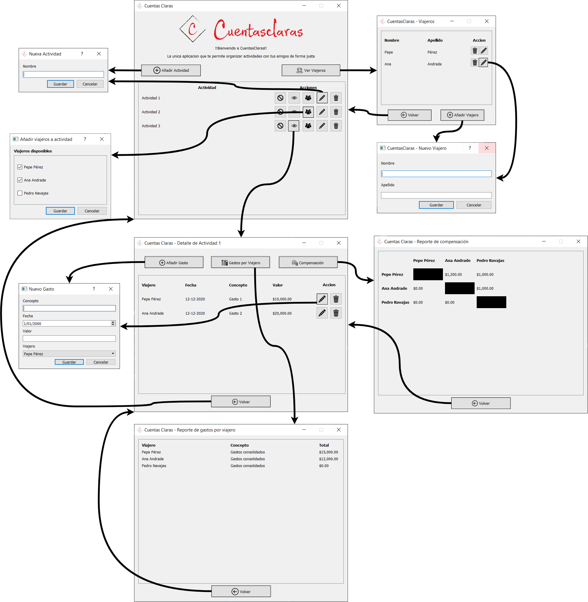

## Semana 4 - Árbol de navegación del proyecto

 

### Ventana Principal - Lista de actividades

Esta es la lista de actividades. Desde acá se pueden ver todas las actividades de la aplicación.

 

Esta ventana permite la creación y edición de actividades:

La asignación de viajeros existentes a las actividades listadas

La eliminación y terminación de actividades está contemplada a través de los botones correspondientes.

También es posible acceder a la lista de viajeros y al detalle de la actividad.

### Ventana Principal - Lista de viajeros

La lista de viajeros muestra todos los viajeros registrados en la aplicación.

Esta ventana permite además la creación, edición y eliminación de viajeros.

### Ventana Principal - Detalle de actividad

Esta ventana permite ver los gastos de una actividad en particular (accediendo desde la lista de actividades)

 

Desde aquí es posible registrar un gasto

 

Ver el reporte consolidado de gastos

 

Y ver el reporte de compensación de viajeros para la actividad

 
