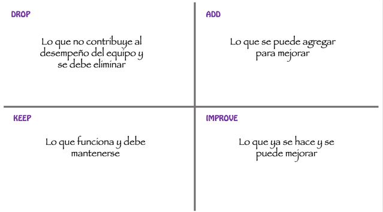

## Retrospectiva DAKI

Una retrospectiva es una sesión en la que un equipo de trabajo se analiza con el fin de identificar aspectos que pueda mejorar. DAKI (Drop Add Keep Improve) es una técnica sencilla para realizar una retrospectiva. 

A continuación, se proponen los pasos para realizar la retrospectiva del proyecto: 

1. Prepare un tablero de 2 x 2 con los cuadrantes que se muestran en la siguiente imagen:

 

2. Cada miembro del equipo, de forma individual, reflexiona y anota sus comentarios para cada uno de los cuadrantes, teniendo en cuenta cómo funcionó el grupo.
3. Los miembros del grupo comparten sus comentarios para cada cuadrante y agrupan los que se relacionan entre sí.
4. El equipo selecciona los dos aspectos que consideren más importantes para mejorar. Para cada uno, establecen acciones que aplicarán en el próximo proyecto. 
